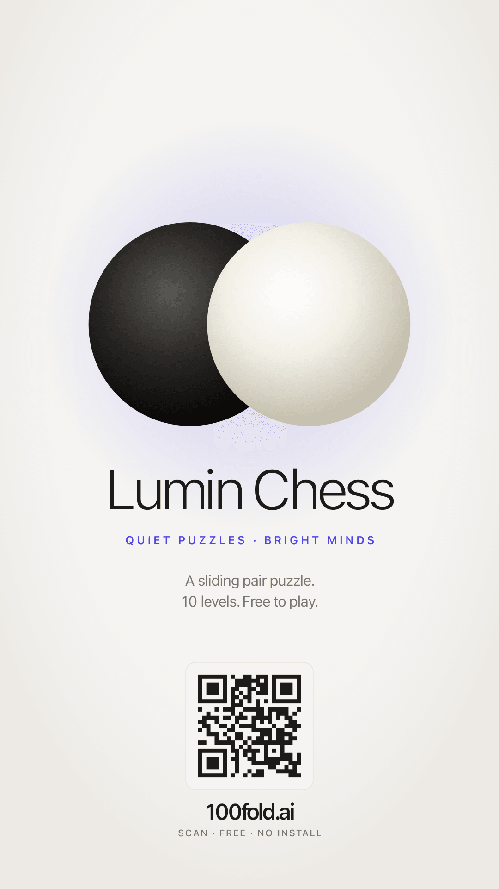

# Lumin Chess

> Quiet puzzles, bright minds.

A single-player sliding-pair puzzle. Swap rows of stones by sliding two
adjacent pieces together — no single-piece moves, no diagonals. The cleanest
solve in the fewest moves climbs the global leaderboard.

**Play in your browser:** https://100fold.ai/

[](https://100fold.ai/)

---

## Rules in one paragraph

Two pieces in horizontally- or vertically-neighboring cells slide together
one cell, in any of the four cardinal directions, into an empty pair of
cells. You win when every black piece is on a former-white cell and every
white piece is on a former-black cell. Some levels add gray pieces (which
move but have a fixed home cell) or blocked cells (which can't be entered).

There are 10 hand-tuned levels. Ten times the patience pays off.

## How to move

- **Straight swipe** — drag along a pair to slide it along its own axis
  (e.g. a horizontal pair swiped right).
- **L-shape swipe** — drag across a pair, then turn 90° in the slide
  direction (e.g. a horizontal pair swiped down: trace the row, then dip).
  This is how you slide a pair perpendicular to itself without ambiguity.
- **Two-finger drag** — put one finger on each piece of a pair, drag both.
  Direct manipulation — your fingers *are* the pair.

A short interactive tutorial appears on first run; reopen it any time from
the `?` button in the top-right.

## Tech

- **Frontend:** a single `index.html` (~110 KB), no build step. Plain
  JS/CSS/SVG. The board, animations, swipe-guide, audio, and haptics all
  live in that one file.
- **Android shell:** wrapped via Capacitor 7 (`com.luminindustries.luminchess`).
  Native plugins: SplashScreen, StatusBar, Haptics.
- **Leaderboard backend:** `leaderboard.php` (file-locked JSON store, top
  100 per level, sparse multi-level storage, CORS for cross-platform sync).
- **Web hosting:** Bluehost shared, with Cloudflare-friendly `no-cache`
  headers on the HTML.

## Repository layout

```
apk/
├── index.html             Game source (single file, ~110 KB).
├── leaderboard.php        Top-100-per-level backend (atomic JSON store).
├── level-editor.html      Web-based level designer / par calculator.
├── levels.json            Verified-par level catalog.
├── assets/                icon-only.svg, splash.svg, splash-dark.svg
├── brand/                 Header art and feature graphics for store listings.
├── ads/                   1080×1920 Instagram Story ads (PNG).
├── android/               Capacitor Android project (excludes signing keys).
├── play-submission/       Play Store screenshots (phone / tablet variants).
├── scripts/
│   ├── build-web.sh         Stage web-deploy/ from current index.html.
│   ├── deploy-ftp.py        FTPS push to Bluehost (bumps APP_VERSION first).
│   ├── build-apk.sh         Debug APK → repo root.
│   ├── build-release.sh     Signed release AAB + APK → repo root.
│   ├── copy-web.js          Mirror index.html into www/ for Capacitor.
│   ├── build-launcher-icons.js  Regenerate Android launcher icons from icon-only.svg.
│   ├── build-brand-assets.js    Regenerate developer-profile assets.
│   ├── build-ads.js         Render the three Instagram Story ads.
│   ├── seed-leaderboard.py  Populate the live leaderboard with dummy data.
│   └── solve-optima.js      BFS solver to compute verified pars.
└── README.md              This file.
```

## Local development

1. `git clone` this repo.
2. `npm install` — pulls Capacitor + sharp + qrcode.
3. Serve the single file: `python3 -m http.server 8767` and open
   `http://localhost:8767/`.

Edit `index.html` directly. There is no bundler.

### URL flags

| Flag | What it does |
|---|---|
| `?unlock=all` | Open every level, suppress leaderboard POSTs. Used for screenshots and local testing. |
| `?lb=peek-all` | Auto-open the leaderboard overlay with every level's tab visible. Bypasses the unlock gating; doesn't change game state. |

## Android

```bash
./scripts/build-apk.sh        # debug APK at lumin-chess.apk
./scripts/build-release.sh    # signed AAB + APK (needs android/keystore/)
```

The signing keystore + keystore.properties are not in the repo. To produce a
signed build you'll need your own upload-keystore.jks. Generate one with
`keytool -genkey -v -keystore upload-keystore.jks -alias <alias>
-keyalg RSA -keysize 2048 -validity 10000` and drop it at
`android/keystore/upload-keystore.jks` with matching
`android/keystore.properties`.

## License

[GNU General Public License v3.0](LICENSE) (GPL-3.0).

Plain English: you may use, modify, and redistribute this code. Any
distributed modification must be released under the same license, with
source available. Strong copyleft — you can't take this code and ship a
closed-source product. See the license text for the exact terms.

The Lumin Chess name, two-stones brand mark, and the visual design (palette,
typography, audio, animation choices) are not part of the AGPL grant. If
you fork the code, please use your own brand identity.

## Credits

Built by Peter Lyu (Lumin Industries).
